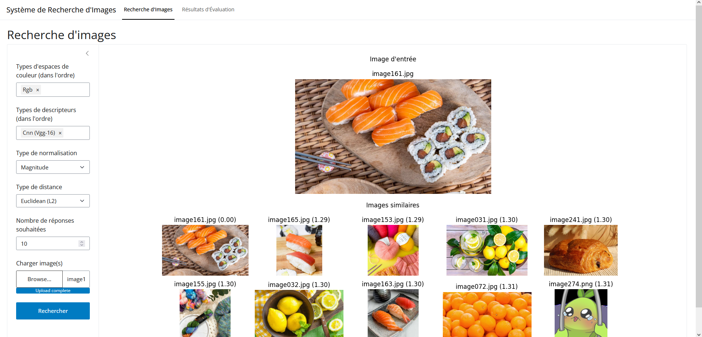

# 📚 Project Overview
Projet d'Université durant ma 5ème année (2ème année de Master), sur le traitement et l'analyse d'images.


## 📦 Dépendances  
Pour installer toutes les dépendances nécessaires, utilisez la commande suivante :  

```bash
pip install numpy pandas pillow shiny seaborn faicons pydicom
```

<br>

## 🚀 Project File Tree
```bash
📂 INFO0911_ImageAnalysis/
├── 📸 database/                      # Base de données d'images
│   ├── 🍍 Ananas_8/                  # Images d'ananas
│   └── ...
│
├── ⚡ cache/                                      # Cache des images (par offline_computing.py, cache: 114 240 fichiers (30 Go))
│   ├── 🗂️ image011_cmyk_cnnvgg16_magnitude.npz	# Cache pour l'image 011 avec le color space cmyk, le descripteur vgg16 et la normalisation par magnitude
│   └── ...
│
├── 🛠️ src/
│   ├── 🎨 color_spaces/                # Implémentation des color spaces
│   ├── 🏷️ descriptors.py               # Implémentation des descripteurs
│   ├── 📊 normalization.py             # Implémentation des normalisations
│   ├── 📏 distances.py                 # Implémentation des distances
│   ├── 🖼️ image.py                     # Classe ImageData permettant de retenir plus d'informations sur les images (color space, etc.)
│   ├── 🔎 search_engine.py             # Fonctionnalités de recherche d'images
│   ├── 🎯 mean_average_precision.py    # Fonctionnalités de calcul de la mAP
│   ├── 🖨️ print.py                     # Utilitaires d'affichage
│   ├── 📦 requirements.py              # Installation automatique des dépendances lors de l'import (✅ compatible venv, ❌ incompatible uv)
│   └── ...
│
├── 📊 evaluation_results/
│   └── 📄 results.csv                 # Résultats de la mAP pour chaque combinaison de descripteurs et de normalisations
│
├── ⚙️ config.py                   # Configuration de l'application
├── 🌐 app.py                      # Lancement de l'application web (Recherche d'images et comparaison des méthodes)
├── 🚀 offline_computing.py        # Pré-calculs de toutes combinaisons de méthodes sur chaque image
├── 📈 evaluate_descriptors.py     # Calcul de la mAP pour chaque combinaison possible
└── ...
```

<br>

## 📌 Travail réalisé avant présentation
```bash
├── 🎨 COLOR_SPACES_CALLS                ## Espaces de couleur implémentés
│   ├── 🟥 RGB                           # Espace de couleur classique
│   ├── ⚫ Grayscale (average)           # Conversion en niveaux de gris (moyenne)
│   ├── ⚫ Grayscale (norm 709)          # Conversion en niveaux de gris (norme 709)
│   ├── ⚫ Grayscale (norm 601)          # Conversion en niveaux de gris (norme 601)
│   ├── 📏 YIQ                           # Espace YIQ
│   ├── 📏 YUV                           # Espace YUV
│   ├── 📏 I1I2I3                        # Espace I1I2I3
│   ├── 🎨 RGB Normalisé                 # Espace RGB normalisé
│   ├── 🎨 HSL                           # Espace HSL
│   ├── 🎨 HSV                           # Espace HSV
│   ├── 🎨 CMYK                          # Espace CMYK
│   ├── 🌈 L*a*b                         # Espace CIELAB
│   ├── 🌈 L*u*v                         # Espace CIELUV
│   ├── 🔢 Indexation (2,2,2)            # Réduction des couleurs avec indexation 2x2x2
│   ├── 🔢 Indexation (4,4,4)            # Réduction des couleurs avec indexation 4x4x4
│   └── 🔢 Indexation (8,8,8)            # Réduction des couleurs avec indexation 8x8x8
│
├── 🏷️ DESCRIPTORS_CALLS                 ## Descripteurs implémentés
│   ├── 📊 Histogram                     # Histogramme classique
│   ├── 📊 Histogram (HSV/HSL)           # Histogramme pondéré sur la saturation
│   ├── 📊 Histogram Blob                # Histogramme de blobs
│   ├── 🔀 Weighted Gradient Histogram   # Histogramme pondéré des gradients
│   ├── 🔬 Statistics                    # Statistiques de l'image
│   ├── 🔲 Local Binary Pattern          # LBP pour la détection de textures
│   ├── 🔬 Haralick                      # Descripteur de Haralick pour textures
│   └── 🤖 CNN (VGG-16)                  # Descripteur basé sur CNN VGG-16
│
├── 📊 NORMALIZATION_CALLS               ## Méthodes de normalisation implémentées
│   ├── 🚫 Aucune                        # Pas de normalisation
│   ├── 🔢 Probability                   # Normalisation par probabilité
│   ├── 📏 Magnitude                     # Normalisation par magnitude
│   ├── 🔀 Min-Max                       # Normalisation Min-Max
│   ├── 📉 Standardization               # Standardisation (Z-score)
│   └── 🏅 Rank                          # Normalisation par rang
│
└── 📏 DISTANCES_CALLS                   ## Fonctions de calcul de distance implémentées
    ├── 📏 Manhattan (L1)                # Distance de Manhattan
    ├── 📏 Euclidean (L2)                # Distance Euclidienne
    ├── 🛑 Chebyshev                     # Distance de Chebyshev
    ├── 🔢 Minkowski                     # Distance de Minkowski
    ├── 📉 Khi2                          # Distance Khi-carré
    └── 🏆 Histogram Intersection        # Intersection d'histogrammes
```
Additionnellement, une mise en cache est effectué à chaque application d'une méthode sur les images sans besoin d'appel de `offline_computing.py`<br>
La classe ImageData a été créée pour éviter d'envoyer trop de paramètres aux méthodes des fonctions, elle retient le color space utilisé ainsi que les ranges de chaque channel (ex: 0-255 pour RGB).

L'application (web) peut prendre multiples méthodes si on le souhaite, l'ordre est maintenu. (ex: HSV + Indexation, VGG + Histogram, etc.)




<br>

## ✅ Fait après la présentation
├── 🔀 **Concaténation des descripteurs** (quand on choisi plusieurs descripteurs en même temps)
│   ├── Au lieu d'appliquer un descripteur sur la sortie d'un autre, les descripteurs sont maintenant concaténés.
│   ├── Cette approche permet une meilleure représentation des caractéristiques de l'image.
│   └── Mise à jour de `descriptors.py` et du moteur de recherche (`search_engine.py`).
│
├── 💾 **Mise en cache des normalisations**
│   ├── Les normalisations des descripteurs sont désormais stockées en cache.
│   ├── Accélération peu notable étant donné que l'opération est déjà très rapide.
│   └── Mise à jour de `search_engine.py`.
│
└── 💾 **Mise en cache des distances**
    ├── Les distances entre lot d'images sont maintenant stockées afin de recalculer plus rapide la mAP. (cela n'accélère en aucun cas la recherche d'images)
    └── Mise à jour de `mean_average_precision.py` et `search_engine.py`.

Pour analyser les résultats du classement basé sur la **mAP (Mean Average Precision)**, il faut examiner les scores obtenus pour chaque combinaison de **color space**, **descripteur**, **normalisation**, et **distance** dans le fichier `evaluation_results/results.csv`.  

<br>

## 📊 **Analyse des résultats**
Tout d'abord, le temps de calcul étant énorme, toutes les combinaisons n'ont pas pu être mesurées à temps.<br>
Dernière progression enregistrée : `220k / 350k`<br>
Nombre de score calculés : `3689 / 5868`<br>
Voir `results.csv` ou l'onglet `Résultats d'Évaluation` sur l'application pour plus d'informations

Ceci étant dit, voici les résultats trouvés

- **Meilleur combinaison** : 📈  
  - En général, les **descripteurs CNN (VGG-16)** ont souvent un avantage significatif car ils capturent des caractéristiques complexes de l’image.  
  - La meilleure combinaison qui resort est `RGB | CNN (VGG-16) | Euclidean (L2) | Magnitude` avec un score de `0.7209`
  - La seconde meilleure est `RGB | CNN (VGG-16) | Euclidean (L2) | Standardization` avec un score de `0.7154`

- **En oubliant le CNN** : 🔢  
  - Après avoir retiré VGG-16 de la liste, nous avons la combinaison suivante  `RGB | Histogram | Euclidean (L2) | Standardization` avec `0.4362` en score

- **Meilleure distance** : 📏  
  - La **distance Euclidienne (L2)** est la préférée pour le descripteur CNN.
  - Cependant, La **distance Manhattan (L1)** semble plus populaire dans le classement général.
  - Les autres distances n'apparaissent pas, probablement dû aux calculs restants. 

<br>

Merci d'avoir lu, signé
- COLLIGNON Alexandre

